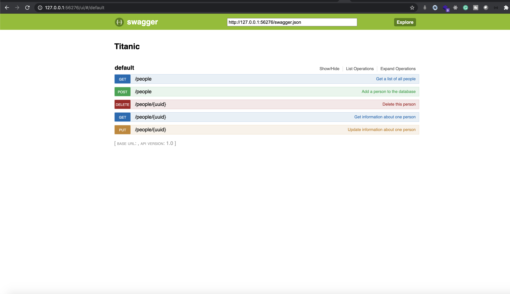
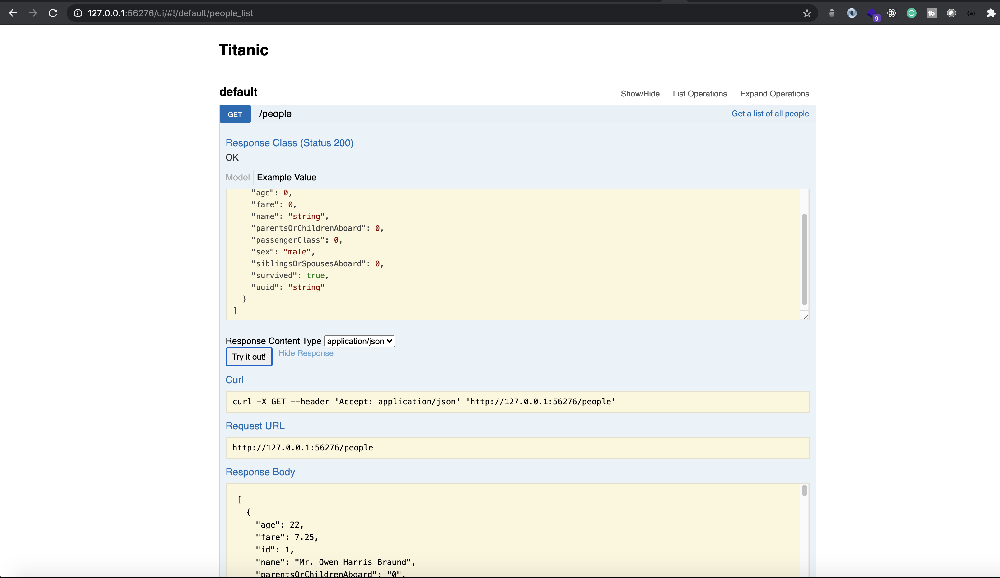

# scope-devops-interview-challenge

This exercise is to assess your technical proficiency with DevOps and Infrastructure tasks.
There is no need to do all the exercises, but try to get as much done as you can, so we can get a good feel of your skillset.  Don't be afraid to step outside your comfort-zone and try something new.**Please provide documentation for everything.**
If you have any questions, feel free to reach out to us.

## Exercise

This exercise is split in several subtasks. We are curious to see where you feel most comfortable and where you struggle.

### 1. Setup & fill postgres database

In this project you'll find a csv-file [titanic.csv]  with passenger data from the Titanic. 
Follow these steps to create a docker image of the database [titanic-postgres](titanic-postgres/).
Alternatively you could use your own postgres installation or use a managed instance in cloud.

### 2. Dockerize the Python API

An HTTP-API that allows reading & writing,updating & deleting data from our postgres database.
Tech stack used is Python Flask with Postgres . The API is described in [API.md](./API.md).
An OpenAPI specification is also provided (see [swagger.yml](./swagger.yml)). 
It requires python 3.7 . Also the following environment variables are required for the application to start

| Environment Variables  | Description                                            |
| -----------------------| ------------------------------------------------------ |
| POSTGRES_USER          | Username required to connect to postgres database      |
| POSTGRES_PASSWORD      | Password required to connect to postgres database      |
| POSTGRES_DB            | Database name required to connect to postgres database |
| POSTGRES_HOST          | Hostname required to connect to postgres database      |
| POSTGRES_PORT          | 5432                                                   |

Swagger UI runs at port 5000 and the API itself at port 8000

### 3. Deploy to Kubernetes (free, cloud) Using Helm

Install [MiniKube](https://kubernetes.io/docs/setup/minikube/) or [ Azure Kubernetes Service](https://azure.microsoft.com/en-us/services/kubernetes-service/) or [Amazon Elastic Kubernetes Service](https://aws.amazon.com/eks/) or [ Google Kubernetes Engine](https://cloud.google.com/kubernetes-engine) and deploy the stack using [Helm](https://helm.sh/) to kubernetes.

### 4. Create a simple CI/CD pipeline using Jenkins to build and deploy to kubernetes 
    1.  You could install jenkins and minikube on a vm / local machine.
    2.  Alternatively you can also deploy jenkins/kubernetes in Azure(Preferred),AWS,GCP and implement CI/CD there.

### Access the swagger endpoint and check if the api works properly
     For eg. in our case http://<YOUR_IP>:<YOUR_PORT>/ui/#/default
     You could also decide to expose the api differently as well.

     
     If everything is setup correctly GET request should return the data from the database.

### 5. Whatever you can think of
Do you have more ideas to optimize your workflow or automate deployment? Feel free to go wild and dazzle us with your solutions.