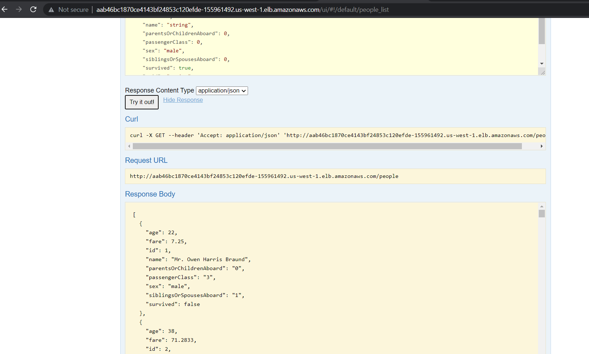

## Building Docker images
Build the container image using following command.

1. Create postgresql image and push to private container registry.
```
$ cd docker/postgresql/
$ docker build -t nexgtech/postgresql:11.5.1 .
$ docker push nexgtech/postgresql:11.5.1
```

2. Create api image and push to private container registry.
```
$ cd docker/api/ 
$ docker build -t nexgtech/titanic-api .
$ docker push nexgtech/titanic-api
```


## Image pull secrets in kubernetes

Create a new image pull secret object which used to pull docker image from private registry. 
```
$ kubectl create secret docker-registry regcred --docker-server="<server-host>" --docker-username="<username>" --docker-password="<password>"
```
* <server-host> docker registry url e.g https://index.docker.io/v2/
* <username> Docker username
* <password> Docker password
* <email> is your Docker email.

Pass the newly created secret name to a value.yaml of helm chart
```
imagePullSecrets:
  - name: regcred
```

## deploy application using helm chart on Kubernetes
1. deploy postgresql
```
$ helm lint postgresql
$ helm install titanic-db . 
```

2. Deploy api application 
```
$ helm install titanic-api .
```

3. Get api app service url by executing below cmd.
```
$ kubectl get svc
```

## This is how application appears when it runs.
Access the swagger endpoint url

